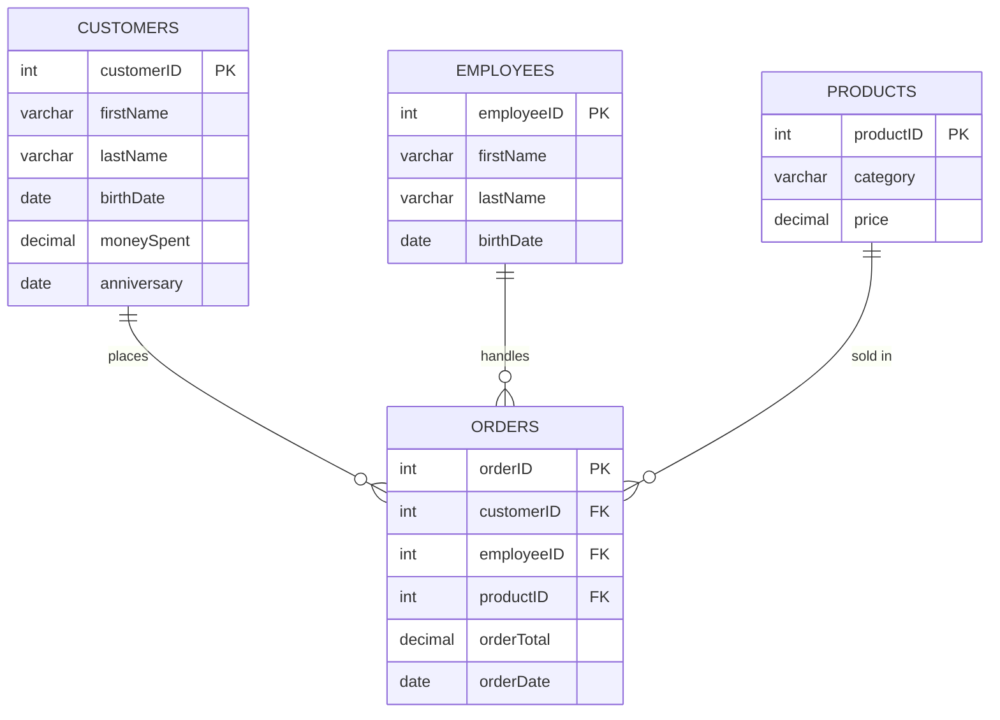
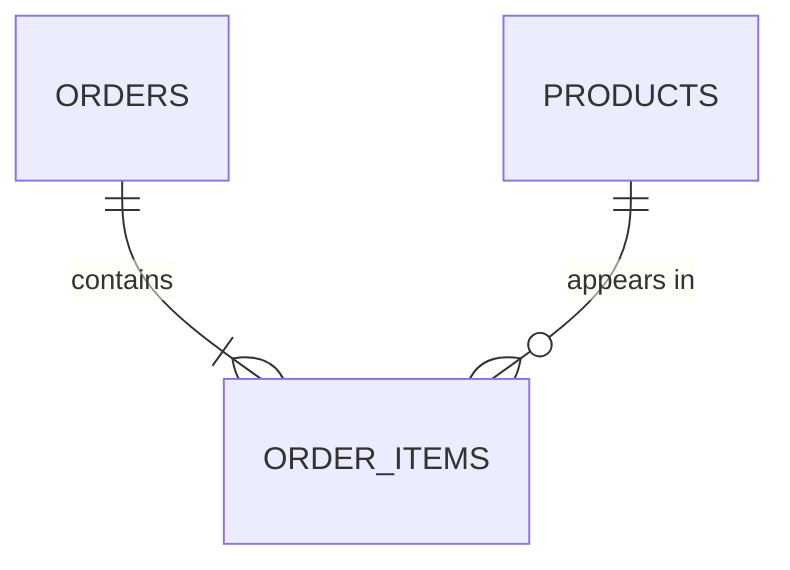

# Lecture 2 — From One File to Four Tables

**A hands-on guide** · Introduction to Databases & SQL · YSU, Data Science for Business

---

## How to use this guide

This is written to be worked through at a keyboard, not just read. Each part
explains one idea and then hands you SQL to run yourself. Type or paste it
into your own database, look at what actually comes back, and compare it
to the expected output shown before moving on — don't skim a query and
assume you know what it returns.

Total time if you go through it start to finish: **~125 minutes**, at
whatever pace you need. Stop anywhere; nothing here is timed.

## Before you start

You need:

- **PostgreSQL** running somewhere you can connect to, and the `psql`
  client (any SQL client that runs raw SQL and shows you error messages —
  e.g. DBeaver — also works).
- A terminal open **in this folder** (`lectures/lecture_2/` — the same
  folder as this file and `lecture-02-demo.sql`), which contains a `data/`
  subfolder with `sales_flat.csv` and the four expected-result CSVs.
  `\copy` resolves file paths relative to wherever you *started* `psql`,
  not the database server — getting this wrong is the most common cause
  of a "file not found" error below.

Create a scratch database and connect to it:

```bash
sudo -u postgres psql
createdb lecture02
psql lecture02
```

Not sure what a command does once you're in `psql`, or hitting a
connection error? See `psql-cheatsheet.md` in this folder — it also has
a Docker-based setup if your local PostgreSQL install is giving you
trouble (missing role, port conflicts, multiple versions installed).

No `createdb` on your machine, or don't want to make a new database at
all? A table has to live inside *some* database, but it doesn't have to
be a new one — run `psql` with no database name and you'll land in
whatever default database already exists on your system (often named
after your OS user, or `postgres`), and `CREATE TABLE` works there
immediately. `createdb` above just keeps this lecture's tables out of
your way afterward; it isn't required. If you do want a fresh one without
`createdb`, connect to any existing database and run
`CREATE DATABASE lecture02;`, then `\c lecture02`.

Three ways to work through what follows — pick one:

- **Statement by statement (recommended the first time):** copy each SQL
  block below into your `psql` session as you read, and compare your
  output to what's shown. All paths in this guide are written relative to
  **this** folder (`lecture_2/`), so run `psql` from here.
- **All at once:** open `lecture-02-demo.sql` and run it with `\i`, then
  scroll back through the output as you read the explanations here.
- **One file per Part, for following along live:** the `steps/` folder
  has one script per Part — `steps/00-create-database.sql` through
  `steps/09-alter-and-drop.sql`, numbered to match the Parts below. Parts
  1 and 5 are split in two — `01-01-load.sql` / `01-02-explore.sql` and
  `05-01-insert.sql` / `05-02-check.sql` — so the queries can be re-run
  without reloading. Part 2's file is comments only (that Part is
  diagram/discussion, no code to run). Run each with `\i steps/04-ddl.sql`
  (etc.) as you reach it, still from a `psql` session started in this
  folder.

## Where we left off

Lecture 1 ended by *defining* SQL — but you haven't written a line of it
yet. It also showed the schema slide: four tables, with exact columns and
types.

| Table | Columns |
|---|---|
| **Customers** | `customerID INT`, `firstName VARCHAR(50)`, `lastName VARCHAR(50)`, `birthDate DATE`, `moneySpent DECIMAL(10,2)`, `anniversary DATE` |
| **Employees** | `employeeID INT`, `firstName VARCHAR(50)`, `lastName VARCHAR(50)`, `birthDate DATE` |
| **Products** | `productID INT`, `category VARCHAR(100)`, `price DECIMAL(8,2)` |
| **Orders** | `orderID INT`, `customerID INT`, `employeeID INT`, `productID INT`, `orderTotal DECIMAL(10,2)`, `orderDate DATE` |

**In this guide, you build exactly that schema — out of one file.**

Lecture 1 also made two claims, on the "File System" and "Database
Approach" slides: that files cause redundancy and inconsistency, and that
the database approach fixes it. Those were assertions. Here, they become
something you do with your own hands — first by finding the redundancy
yourself, then by *modeling* your way out of it, and only then by writing
the SQL that implements the model.

**By the end of this guide, you should be able to:**

1. Recognize redundancy in a flat file and explain why it is dangerous.
2. Model a small business as entities, relationships and cardinalities,
   and draw the result as an ER diagram.
3. Name a functional dependency, and use it to check a table against
   1NF, 2NF and 3NF.
4. Understand what SQL is (and is not), and how its parts are organized.
5. Create tables with primary keys, foreign keys and constraints.
6. Split one wide file into the four tables from the schema slide — and join them back.
7. Write basic `SELECT` queries.
8. Alter an existing table — add, rename and retype a column, add and
   drop a constraint — and explain why `DELETE`, `TRUNCATE` and
   `DROP TABLE` each refuse to remove something another table depends on.

---

## Part 1 — The problem in the file (~10 min)

**File:** `data/sales_flat.csv` — 42 rows × 13 columns, one row per sale.
This is what a real spreadsheet export looks like.

```sql
-- IF NOT EXISTS and the TRUNCATE below make this block safe to
-- re-run without erroring if you already ran it once this session.
CREATE TABLE IF NOT EXISTS sales_raw (
    orderID              INT,
    orderDate            DATE,
    customerFirstName    VARCHAR(50),
    customerLastName     VARCHAR(50),
    customerBirthDate    DATE,
    customerMoneySpent   DECIMAL(10,2),
    customerAnniversary  DATE,
    employeeFirstName    VARCHAR(50),
    employeeLastName     VARCHAR(50),
    employeeBirthDate    DATE,
    productCategory      VARCHAR(100),
    productPrice         DECIMAL(8,2),
    orderTotal           DECIMAL(10,2)
);
```

Load it. `\copy` runs on **your** machine (a psql command); `COPY` runs on
the **server**. Run this from `psql` started in the `lecture_2/` folder:

```sql
TRUNCATE TABLE sales_raw;

\copy sales_raw FROM 'data/sales_flat.csv' WITH (FORMAT csv, HEADER true);

SELECT * FROM sales_raw ORDER BY orderDate, orderID LIMIT 10;
```

> **No access to the CSV file** (crashed laptop, no file access, working
> from a paste buffer)? `data/sales_flat_inserts.sql` has the exact same
> 42 rows as plain `INSERT` statements — no file, no `\copy`, nothing but
> SQL. Run it instead of the block above:
> ```sql
> \i data/sales_flat_inserts.sql
> ```
> Verified to produce byte-identical data to the `\copy` version — the
> rest of the lecture doesn't care which one you used.

### Guess before you run

Look at the 10 rows you just printed and guess: **how many customers does
this shop actually have?** Write your number down — then run the next
three queries and see how close you were.

```sql
SELECT count(*)                         AS total_rows     FROM sales_raw;  -- 42
SELECT count(DISTINCT customerLastName) AS real_customers FROM sales_raw;  -- 8
SELECT count(DISTINCT productCategory)  AS real_products  FROM sales_raw;  -- 6
```

**42 rows, but only 8 customers and 6 product categories.** Davit's birth
date is stored eight times. The Laptops price is stored twelve times.

```sql
SELECT customerFirstName, customerLastName, count(*) AS times_stored
FROM sales_raw
GROUP BY customerFirstName, customerLastName
ORDER BY times_stored DESC;
```

Run it and confirm that for yourself.

### Why redundancy is dangerous

Before reading the table below, work through each row yourself: what
actually breaks, and what would you call the failure?

| Scenario | What happens | Name |
|---|---|---|
| Anna's birth date was entered wrong | You must fix **every** copy | update anomaly |
| You miss one copy | Two different "truths" now exist | **inconsistency** |
| A new product category hasn't sold yet | Nowhere to put it — there's no row | insertion anomaly |
| You delete the last order in a category | The category vanishes entirely | deletion anomaly |

This is exactly what Lecture 1's "File System" slide claimed. Now you've
seen it in your own data.

Fixing this needs a method, not a guess. That method is **data
modeling**, and it's what Part 2 is about.

---

## Part 2 — Data modeling: entities, relationships, and normal forms (~40 min)

Before a single table gets created, a database designer models the
business: decides what things need tracking, how those things relate to
each other, and what uniquely identifies each one. This is that step,
done properly on paper before you write a single `CREATE TABLE` — skip it
and you're back to guessing, which is how you end up with a file like
`sales_raw`.

### Entities, attributes, relationships

Three words carry the whole idea:

- **Entity** — a real-world *thing* the business needs to track, with an
  existence of its own. In our shop: `Customer`, `Employee`, `Product`.
- **Attribute** — a fact *about* an entity. A customer's `firstName`,
  `birthDate`, `moneySpent`.
- **Relationship** — how two entities interact. A customer *places* an
  order; an employee *handles* an order; an order *is for* a product.

Notice `Order` isn't in the entity list above. An order doesn't exist on
its own — it only exists because a customer, an employee and a product
came together at a moment in time. That makes it an **event**, and events
are exactly what relationships between entities look like once you give
them their own row. This is the same distinction the file collapsed and
you're now restoring.

### Cardinality: how many relate to how many

For every relationship, ask *how many of one side can pair with how many
of the other*:

- **One-to-many (1:N):** one customer can place many orders; each order
  belongs to exactly one customer.
- The same shape holds for employees (one employee handles many orders)
  and products (one product appears in many orders).

ER diagrams draw this with **crow's foot notation** — a pair of symbols
at each end of the connecting line, read from that entity's side:

```
──||   exactly one
──o|   zero or one
──|{   one or many
──o{   zero or many
```

### The ER diagram for our store

Strip away the SQL and this is the actual shape of the business:



Read one relationship out loud: "one customer places zero-or-many
orders; each order places for exactly one customer." Now compare this
diagram, box by box, against the schema slide from Lecture 1 — it's the
same four tables. The ER diagram and the schema slide are the same design
seen two ways: one as a picture you reason with, one as the table you'll
type.

### The question that earns the key concept

Drawing boxes is easy. Deciding what uniquely identifies a row inside
each box is the actual design work:

> *"What identifies a customer? We have no email, no phone number — just
> names and a birth date."*

Try to answer it yourself before reading on:

- **First name?** Obviously not.
- **First + last name?** Two people can both be "Anna Sargsyan."
- **First + last + birthDate?** Now it's *probably* unique. This is a
  **composite natural key** — three attributes together doing the job of
  one.
- **But it's fragile:** three columns to carry into every other table, a
  typo in any of them breaks the link, and it still isn't guaranteed
  unique.

**So we invent `customerID`** — a **surrogate key**, one small integer
that means nothing outside the database and never changes. That's the
`PK` you saw on `CUSTOMERS` in the diagram above, and now you know *why*
it's there rather than just that it is.

> **Optional — worth 3 minutes if you're curious.**
> Look at `moneySpent` on Customers. Where does that number come from?
> It's the sum of that customer's orders — the database can compute it
> any time. Storing it means every new order must also update it, and if
> that ever fails, the stored number silently disagrees with reality.
> Stored-vs-computed is a real design trade-off, and we'll come back to
> it. *(In our file `moneySpent` does match the order totals —
> verifiable after the split, in Part 7.)*

### Optional aside: what if one order could hold several products?

Our diagram makes each `Order` reference exactly one product — one line
per sale. A real shopping cart doesn't work that way: one order usually
contains *several* products, and one product appears in many orders.
That's a **many-to-many (M:N)** relationship, and crow's foot notation
can't attach it directly to a single foreign key — you need a table in
between, one row per (order, product) pair:



`ORDER_ITEMS` isn't a real-world entity anyone would name on their own —
it exists purely to carry two foreign keys. Every M:N relationship you'll
ever model resolves to this same trick: a junction table in the middle.
We're simplifying to one product per order for this lecture; keep this
picture in mind, it comes back below.

### Functional dependencies: the rule underneath all of this

Everything so far has been diagrams and intuition. There's a precise way
to say *why* `sales_raw` is redundant, and it starts with one idea:
attribute (or set of attributes) **A functionally determines** attribute
**B** — written **A → B** — if every value of A is associated with
exactly one value of B.

`orderID → orderDate` holds: one order, one date. So does
`orderID → customerFirstName`, and every other column in the row —
`orderID` is a candidate key for `sales_raw`, so by definition it
determines everything else in that row. The dependencies worth noticing
are the ones *between the other columns*:

```
(customerFirstName, customerLastName, customerBirthDate) → customerMoneySpent
(customerFirstName, customerLastName, customerBirthDate) → customerAnniversary
```

A customer's balance and anniversary depend on *which customer it is*,
not on which order carried the row. That single observation is the whole
mechanism behind the redundancy from Part 1, and it's what normal forms
give you a vocabulary for.

### Normal forms: making "redundant" precise

A **normal form** is a rule a table either satisfies or doesn't, aimed at
one kind of redundancy. Run `sales_raw` through the first three:

**1NF — every column holds one atomic value; no repeating groups.**
`sales_raw` already satisfies this: one date per row, one price per row,
nothing stuffed into a list. If a shop instead recorded a multi-item
order as a single row with `productCategory = 'Audio, Laptops'`, *that*
would break 1NF — and it's exactly the many-to-many case from the aside
above, which is why the fix there was also a separate table.

**2NF — no non-key attribute depends on only part of a composite key.**
This rule only has teeth when the key has more than one column.
`sales_raw`'s key is the single column `orderID`, so there's no "part of
the key" to depend on partially — 2NF is satisfied automatically. (You'd
meet a real 2NF violation the moment `ORDER_ITEMS` above also stored
something like `productCategory` "for convenience": that column would
depend only on `productID`, half of the composite key
`(orderID, productID)`, not on the pair as a whole. That's a **partial
dependency** — the textbook 2NF violation — and the fix is simply not to
store it there; `productCategory` is already reachable through
`products`.)

**3NF — no non-key attribute depends on another non-key attribute.**
This is the one `sales_raw` actually breaks. As the functional
dependencies above show:

```
orderID → (customerFirstName, customerLastName, customerBirthDate) → customerMoneySpent
```

`customerMoneySpent` doesn't depend on `orderID` directly — it depends on
a *non-key* attribute (which customer this is), which in turn depends on
the key. That chain, key → non-key attribute → another non-key attribute,
is a **transitive dependency**, and it is the formal name for the
redundancy you measured by hand in Part 1. The same chain exists for
every employee and product attribute.

**Fixing it is exactly what Parts 4 and 5 do.** Pulling customer
attributes into their own table, keyed by the customer's own key, breaks
the chain — `customers.moneySpent` now depends directly on
`customers.customerID` and nothing else. Do the same for employees and
products, and the result is in **third normal form**. You normalized
`sales_raw` by hand before you had a name for what you were doing.

> **Beyond 3NF.** BCNF, 4NF and 5NF exist for edge cases 3NF doesn't
> fully cover — a table with more than one overlapping candidate key, or
> several independent multi-valued facts crammed into one relation. Most
> real business schemas stop at 3NF: it removes almost all the practical
> redundancy, and each further form buys diminishing protection at the
> real cost of more joins. We'll come back to exactly that trade-off next
> lecture, along with the `ORDER_ITEMS` table this section deferred.

You now have a model — normalized, not just diagrammed. Turning it into
something you can actually create and query needs a language — that's
Part 3.

---

## Part 3 — Why SQL (~15 min)

You just modeled this business as four related entities instead of one
flat file — the right call for killing redundancy. But it creates a new
problem: answering one real business question ("show me this month's
receipts") now needs data pulled correctly from all four places at once,
every time. You need a language built for exactly that — defining these
tables, filling them, and recombining them on demand, without you writing
a loop by hand to do it. That language is SQL.

### SQL is declarative

The single most important idea in this lecture.

In Excel or Python you describe **how**: loop through the rows, check each
one, collect the matches. In SQL you describe **what**: "the customers
born before 1990." The database decides *how* — which file to read, in
what order, using which shortcut.

> You state the goal. The system chooses the method.

That is why the same statement can run in 10 milliseconds or 10 minutes —
and why a later lecture is devoted entirely to asking the database *why*
it chose what it chose.

### A short history (one minute)

- **1970** — Edgar Codd at IBM publishes the relational model: store data in plain tables, let a language do the navigating.
- **1974** — IBM's System R builds SEQUEL, later renamed SQL.
- **1979** — Oracle ships the first commercial SQL database.
- **1986** — SQL becomes an ANSI standard.
- **Today** — still the standard, fifty years later.

Worth sitting with: *almost no technology from 1974 is still in daily use.
SQL is. That's why it's worth your semester.*

### The five sub-languages

Think of this as a filing cabinet: every SQL statement you'll meet this
semester goes into one of these five drawers.

| Part | Stands for | Does | Statements |
|---|---|---|---|
| **DDL** | Data **Definition** Language | defines structure | `CREATE`, `ALTER`, `DROP` |
| **DML** | Data **Manipulation** Language | changes data | `INSERT`, `UPDATE`, `DELETE` |
| **DQL** | Data **Query** Language | reads data | `SELECT` |
| **DCL** | Data **Control** Language | controls access | `GRANT`, `REVOKE` |
| **TCL** | **Transaction** Control Language | groups changes | `COMMIT`, `ROLLBACK` |

In this guide, you'll move through them in order: **DDL** → **DML** →
**DQL**. **DCL** and **TCL** come later in the course. DDL itself
bookends the guide — `CREATE` in Part 4, then `ALTER` and `DROP` once
there's a real schema worth changing, in Part 9.

### The types on the schema slide

Every type on that slide is a rule the database enforces for you.

| Type from the slide | Meaning | Note |
|---|---|---|
| `INT` | whole number | ids, counts |
| `VARCHAR(50)` | text, max 50 characters | in PostgreSQL, plain `TEXT` performs identically |
| `DATE` | a calendar date | supports real date arithmetic |
| `DECIMAL(10,2)` | **exact** decimal, 10 digits, 2 after the point | the money type — `0.1 + 0.2` is exactly `0.3` |
| `DECIMAL(8,2)` | same, smaller range | used for `price` |

> **Try it yourself.** If `price` were stored as text instead of a number,
> sorting would put `'9.99'` *after* `'52.00'` — because text sorts
> character by character, not by value. Run this to see it:
>
> ```sql
> SELECT unnest(ARRAY['9.99', '52.00', '100.00']) AS price_as_text
> ORDER BY 1;
> ```
>
> `100.00` sorts before `52.00`, which sorts before `9.99` — the exact
> opposite of numeric order. That's why `price` on the schema is
> `DECIMAL`, not text.

> **Note on naming:** PostgreSQL folds unquoted identifiers to lowercase,
> so `customerID` becomes `customerid`. Everything still works — just
> don't be alarmed when a column header in your own output looks
> different from how it's written here or on the Lecture 1 slide.

---

## Part 4 — DDL: creating the tables (~10 min)

Time to implement the ER diagram from Part 2 — this is exactly the
schema slide, now as real SQL. Run all four:

```sql
-- IF NOT EXISTS makes these safe to re-run if you already ran this
-- part once this session.

-- 6 columns
CREATE TABLE IF NOT EXISTS customers (
    customerID   SERIAL PRIMARY KEY,          -- surrogate key, auto-generated
    firstName    VARCHAR(50) NOT NULL,
    lastName     VARCHAR(50) NOT NULL,
    birthDate    DATE,
    moneySpent   DECIMAL(10,2) DEFAULT 0 CHECK (moneySpent >= 0),
    anniversary  DATE
);

-- 4 columns
CREATE TABLE IF NOT EXISTS employees (
    employeeID   SERIAL PRIMARY KEY,
    firstName    VARCHAR(50) NOT NULL,
    lastName     VARCHAR(50) NOT NULL,
    birthDate    DATE
);

-- 3 columns
CREATE TABLE IF NOT EXISTS products (
    productID    SERIAL PRIMARY KEY,
    category     VARCHAR(100) NOT NULL UNIQUE,
    price        DECIMAL(8,2) NOT NULL CHECK (price >= 0)
);

-- 6 columns — the EVENT table
CREATE TABLE IF NOT EXISTS orders (
    orderID      INT PRIMARY KEY,
    customerID   INT NOT NULL REFERENCES customers(customerID),
    employeeID   INT NOT NULL REFERENCES employees(employeeID),
    productID    INT NOT NULL REFERENCES products(productID),
    orderTotal   DECIMAL(10,2) NOT NULL CHECK (orderTotal >= 0),
    orderDate    DATE NOT NULL
);
```

**Notice what is *not* in `orders`:** no customer name, no category text,
no employee name. Only references — the same `FK` arrows you drew in the
ER diagram. Each fact lives in exactly one place.

### The vocabulary, now that you've seen it in code

| Constraint | Meaning |
|---|---|
| `PRIMARY KEY` | Uniquely identifies a row. Never null, never duplicated |
| `REFERENCES` (foreign key) | This value **must exist** in the other table — *referential integrity* |
| `UNIQUE` | No two rows may share this value |
| `NOT NULL` | This fact is required |
| `CHECK` | A rule you invent, enforced by the database |
| `SERIAL` | Auto-incrementing integer — the database generates the ids |

This is the "Business Impact" line on the schema slide made literal:
*prevents corrupt data entry, ensures financial transactions always map
to valid customers.* The foreign keys are what deliver it.

---

## Part 5 — DML: filling the tables (~10 min)

**Parents first, children last.** The foreign keys won't allow otherwise
— which is itself the lesson: try inserting into `orders` first if you
want to see that for yourself.

`DISTINCT` is what removes the redundancy: 42 rows become 8.

```sql
-- Safe to re-run: clear out any previous run of this part first.
-- All four tables in one TRUNCATE handles the foreign keys between
-- them without needing CASCADE. RESTART IDENTITY resets the
-- SERIAL ids back to 1.
TRUNCATE TABLE orders, customers, employees, products RESTART IDENTITY;

INSERT INTO customers (firstName, lastName, birthDate, moneySpent, anniversary)
SELECT DISTINCT customerFirstName, customerLastName, customerBirthDate,
                customerMoneySpent, customerAnniversary
FROM sales_raw;

INSERT INTO employees (firstName, lastName, birthDate)
SELECT DISTINCT employeeFirstName, employeeLastName, employeeBirthDate
FROM sales_raw;

INSERT INTO products (category, price)
SELECT DISTINCT productCategory, productPrice
FROM sales_raw;
```

Orders are harder: the raw file holds *names and categories*, but the
table needs *id numbers*. You have to translate — and translation is a
`JOIN`.

Notice the customer join uses **all three** columns of the natural key.
That's the fragility from Part 2, now visible in the code.

```sql
INSERT INTO orders (orderID, customerID, employeeID, productID, orderTotal, orderDate)
SELECT r.orderID, c.customerID, e.employeeID, p.productID, r.orderTotal, r.orderDate
FROM sales_raw r
JOIN customers c ON c.firstName = r.customerFirstName
                AND c.lastName  = r.customerLastName
                AND c.birthDate = r.customerBirthDate
JOIN employees e ON e.firstName = r.employeeFirstName
                AND e.lastName  = r.employeeLastName
                AND e.birthDate = r.employeeBirthDate
JOIN products  p ON p.category  = r.productCategory;
```

Check the result:

```sql
SELECT 'sales_raw' AS t, count(*) FROM sales_raw
UNION ALL SELECT 'customers', count(*) FROM customers
UNION ALL SELECT 'employees', count(*) FROM employees
UNION ALL SELECT 'products',  count(*) FROM products
UNION ALL SELECT 'orders',    count(*) FROM orders;
```

Expected: **42 / 8 / 4 / 6 / 42**

> If your `orders` count is not 42, the join is wrong somewhere — this is
> the most common mistake at this step, and the row count is how you
> catch it. Go back through the join conditions one at a time against
> `sales_raw` if you need to debug it.

The four resulting tables are also included as separate files so you can
compare your own output against them: `data/customers.csv`,
`data/employees.csv`, `data/products.csv`, `data/orders.csv`.

---

## Part 6 — DQL: first queries (~10 min)

Run each of these yourself. Before you run one, predict what it will
return — then check.

```sql
SELECT * FROM customers;                                    -- everything

SELECT firstName, lastName, birthDate FROM customers;       -- choose columns

SELECT * FROM customers WHERE birthDate < '1990-01-01';     -- choose rows

SELECT * FROM products  WHERE price > 100;

SELECT * FROM products  ORDER BY price DESC;

SELECT * FROM orders    ORDER BY orderDate DESC LIMIT 5;

SELECT * FROM customers WHERE moneySpent > 3000
                          AND birthDate < '1995-01-01';

SELECT DISTINCT category FROM products;
```

The mental model to keep:

- `FROM` — which table
- `WHERE` — which rows
- `SELECT` — which columns
- `ORDER BY` — in what order
- `LIMIT` — how many

Once you're comfortable, try changing the numbers and dates above and
predicting the new result before you run it.

---

## Part 7 — The payoff: put it back together (~5 min)

By this point you might feel uneasy — you broke one perfectly good table
into four pieces. This is where you put it back together, and see that
nothing was lost.

```sql
SELECT o.orderID,
       o.orderDate,
       c.firstName || ' ' || c.lastName AS customer,
       p.category,
       p.price,
       o.orderTotal,
       e.firstName || ' ' || e.lastName AS soldBy
FROM orders o
JOIN customers c ON c.customerID = o.customerID
JOIN products  p ON p.productID  = o.productID
JOIN employees e ON e.employeeID = o.employeeID
ORDER BY o.orderDate, o.orderID;
```

**42 rows — exactly the file you started with.** Nothing was lost.

But now there is one place to fix a birth date, one place to change a
price, and the database itself refuses to accept nonsense (Part 8 shows
that directly).

**Optional closer on `moneySpent`.** Run this to check a stored number
against reality:

```sql
SELECT c.firstName, c.lastName,
       c.moneySpent      AS stored,
       SUM(o.orderTotal) AS computed
FROM customers c
JOIN orders o ON o.customerID = c.customerID
GROUP BY c.customerID, c.firstName, c.lastName, c.moneySpent
ORDER BY c.customerID;
```

They match today. Ask yourself: *what happens the first time someone
inserts an order and forgets to update `moneySpent`?* That question is
most of why the rest of this course exists.

---

## Part 8 — Watch the database say no (~5 min)

Run each of these yourself, one at a time, and actually read the error
message rather than skimming past it.

```sql
-- 1. an order for a customer who does not exist
INSERT INTO orders VALUES (9999, 999, 1, 1, 100.00, '2024-08-15');
-- ERROR: violates foreign key constraint

-- 2. a negative price
INSERT INTO products (category, price) VALUES ('Broken', -50);
-- ERROR: violates check constraint "products_price_check"

-- 3. a duplicate category
INSERT INTO products (category, price) VALUES ('Laptops', 999.00);
-- ERROR: duplicate key value violates unique constraint
```

> **The point:** a spreadsheet would have accepted all three of these,
> silently. That is the difference between a file and a database.

---

## Part 9 — ALTER and DROP: evolving and retiring a schema (~20 min)

Part 3 named all three DDL verbs — `CREATE`, `ALTER`, `DROP` — but
everything since has only used `CREATE`. A real schema doesn't stay
frozen at the moment you first designed it: the business adds a sales
channel, a column gets renamed to something less embarrassing, a table
needs to go away. This part is the other two-thirds of DDL, tried
against the tables you've already built and filled. Every statement
below was run against a live database before it went in this guide — the
comments show the actual output, not a guess.

### ALTER TABLE: changing your mind safely

Add a column two different ways, and watch the difference a `DEFAULT`
makes:

```sql
-- No DEFAULT: every one of the 42 existing rows gets NULL
ALTER TABLE orders ADD COLUMN saleChannel VARCHAR(20);
SELECT count(*) FROM orders WHERE saleChannel IS NULL;   -- 42
```

You can't promise `NOT NULL` while NULLs already exist — run this and
read the error:

```sql
ALTER TABLE orders ALTER COLUMN saleChannel SET NOT NULL;
-- ERROR: column "salechannel" of relation "orders" contains null values
```

Backfill first, then the same statement works:

```sql
UPDATE orders SET saleChannel = 'in_store' WHERE saleChannel IS NULL;
ALTER TABLE orders ALTER COLUMN saleChannel SET NOT NULL;
```

(If you'd added the column `WITH DEFAULT 'in_store'` in the first place,
Postgres would have backfilled it for you automatically — no NULLs, no
separate `UPDATE`. The trade-off: a `DEFAULT` can't tell "we don't know
yet" apart from "explicitly in-store," which is sometimes exactly the
distinction you need `NULL` for.)

More `ALTER TABLE`, on things you've already built:

```sql
-- Fix a name you're not happy with
ALTER TABLE orders RENAME COLUMN saleChannel TO channel;

-- Make room -- widening is always safe. Shrinking back succeeds here
-- too, but only because none of our names are actually over 50
-- characters; a real shrink can fail if existing data no longer fits.
ALTER TABLE customers ALTER COLUMN firstName TYPE VARCHAR(100);
ALTER TABLE customers ALTER COLUMN firstName TYPE VARCHAR(50);

-- Add a constraint after the fact -- same CHECK vocabulary from Part 4,
-- just applied later. Naming it means you can find and drop it again.
ALTER TABLE orders ADD CONSTRAINT channel_known
    CHECK (channel IN ('in_store', 'online'));
```

Watch the new constraint actually fire, the same way Part 8 watched the
original ones fire:

```sql
UPDATE orders SET channel = 'carrier_pigeon'
WHERE orderID = (SELECT orderID FROM orders LIMIT 1);
-- ERROR: new row for relation "orders" violates check constraint "channel_known"
```

And remove it again:

```sql
ALTER TABLE orders DROP CONSTRAINT channel_known;
ALTER TABLE orders DROP COLUMN channel;
```

`orders` is now back to exactly the six columns from Part 4 — `ALTER`
removes complexity as readily as it adds it. (Didn't name a constraint
yourself? `\d tablename` — from the cheatsheet — lists every constraint's
generated name, in the same `tablename_column_check` pattern you already
saw in Part 8's error messages.)

### DELETE, TRUNCATE, DROP TABLE: three ways to make data disappear

| Statement | Removes | Table survives? |
|---|---|---|
| `DELETE FROM t WHERE ...` | matching rows | yes |
| `TRUNCATE t` | every row | yes, empty |
| `DROP TABLE t` | the table itself, structure and all | no |

All three refuse to touch anything another table still points to — try
each one against `products`, which `orders` references:

```sql
DELETE FROM products WHERE productID = 1;
-- ERROR: update or delete on table "products" violates foreign key
--        constraint "orders_productid_fkey" on table "orders"

TRUNCATE products;
-- ERROR: cannot truncate a table referenced in a foreign key constraint
-- HINT:  Truncate table "orders" at the same time, or use TRUNCATE ... CASCADE.

DROP TABLE products;
-- ERROR: cannot drop table products because other objects depend on it
-- HINT:  Use DROP ... CASCADE to drop the dependent objects too.
```

Three different statements, the exact same refusal underneath: the
foreign key from `orders` to `products` is doing precisely what Part 4
promised — protecting data you didn't ask it to touch.

`IF EXISTS` makes `DROP` safe to run even when you're not sure the table
is there — no error, just a notice:

```sql
DROP TABLE IF EXISTS not_a_real_table;
-- NOTICE: table "not_a_real_table" does not exist, skipping
```

> **What `CASCADE` really does.** The hint above suggests
> `DROP TABLE products CASCADE`, but that phrase is easy to misread as
> "and delete everything that used to point at it." It doesn't.
> `CASCADE` drops the *dependent objects* — here, that's the foreign key
> **constraint** on `orders`, not `orders` itself and not its rows.
> `orders` would survive, just with `productID` no longer checked
> against anything. That's a real, sometimes-useful move, but it's not
> one to try on tables you actually care about — so try it on a
> disposable pair instead:
>
> ```sql
> CREATE TABLE scratch_categories (name VARCHAR(50) PRIMARY KEY);
> CREATE TABLE scratch_items (
>     id  SERIAL PRIMARY KEY,
>     cat VARCHAR(50) REFERENCES scratch_categories(name)
> );
>
> DROP TABLE scratch_categories CASCADE;
> -- NOTICE: drop cascades to constraint scratch_items_cat_fkey on table scratch_items
>
> \d scratch_items          -- still exists, still has its rows -- just no FK anymore
> DROP TABLE scratch_items; -- clean up the sandbox
> ```

Nothing in this part left `customers`, `employees`, `products` or
`orders` actually changed — every `DELETE`/`TRUNCATE`/`DROP` against them
failed on purpose, and the column you added and removed, and the
`firstName` width you widened and shrank back, all net to zero. Confirm
the row counts:

```sql
SELECT 'products' AS t, count(*) FROM products
UNION ALL SELECT 'orders', count(*) FROM orders;
```

Expected: **6 / 42** — unchanged since Part 5.

---

## Summary

- Redundancy in a flat file causes **update, insertion and deletion anomalies**.
- Fix it by **modeling** the business first: one table per real-world
  **entity**, connected by **relationships** with a **cardinality** —
  drawn as an **ER diagram** using crow's foot notation.
- A many-to-many relationship needs a **junction table** in between; ours
  simplifies that away for now.
- A **composite natural key** works but is fragile; that's why we invent **surrogate ids**.
- A **functional dependency** (A → B) says A determines B. A **transitive
  dependency** — key → non-key attribute → another non-key attribute —
  is what made `sales_raw` redundant, and it's a **3NF** violation.
- **1NF** bans repeating groups, **2NF** bans partial dependency on part
  of a composite key, **3NF** bans transitive dependency. Splitting
  `sales_raw` into four tables achieved all three.
- SQL is **declarative** — you say what you want, not how to get it.
- **DDL** defines, **DML** changes, **DQL** reads (DCL and TCL come later).
- **Primary key** identifies · **foreign key** connects · **constraints** enforce.
- Splitting is **lossless** — a `JOIN` rebuilds the original view whenever you need it.
- `ALTER TABLE` adds, renames, retypes and constrains columns after the
  fact — schemas evolve, they don't get redesigned from scratch.
- `DELETE`, `TRUNCATE` and `DROP TABLE` remove progressively more (some
  rows, all rows, the table itself) but all three respect foreign keys —
  `CASCADE` overrides that deliberately, dropping the dependent
  constraint, not the dependent data.

**Next lecture:** here you normalized by hand and stopped at 3NF. Next
time: when it's right to *break* that discipline on purpose
(denormalization trade-offs), and a proper fix for the `order_items`
junction table this lecture deferred. `moneySpent` will still be waiting
for us too.

---

## Files

| File | What it is |
|---|---|
| `data/sales_flat.csv` | The wide file — 42 rows × 13 columns. Load this first |
| `data/sales_flat_inserts.sql` | The same 42 rows as plain `INSERT` statements — a fallback for when the CSV/`\copy` isn't available |
| `data/customers.csv` | Expected result — 8 rows. Compare after Part 5 |
| `data/employees.csv` | Expected result — 4 rows. Compare after Part 5 |
| `data/products.csv` | Expected result — 6 rows. Compare after Part 5 |
| `data/orders.csv` | Expected result — 42 rows. Compare after Part 5 |
| `psql-cheatsheet.md` | Reference for the `psql` client itself — connecting, roles, `\d`, `\copy`, troubleshooting |
| `lecture-02-demo.sql` | Every statement above, runnable in order, in one file |
| `steps/00-create-database.sql` … `steps/09-alter-and-drop.sql` | The same statements, one file per Part — for running along live. Parts 1 and 5 are split into a load/insert file (`-01`) and a queries-only file (`-02`) |
